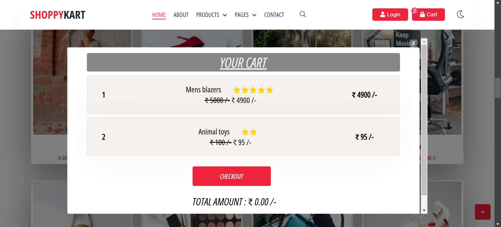
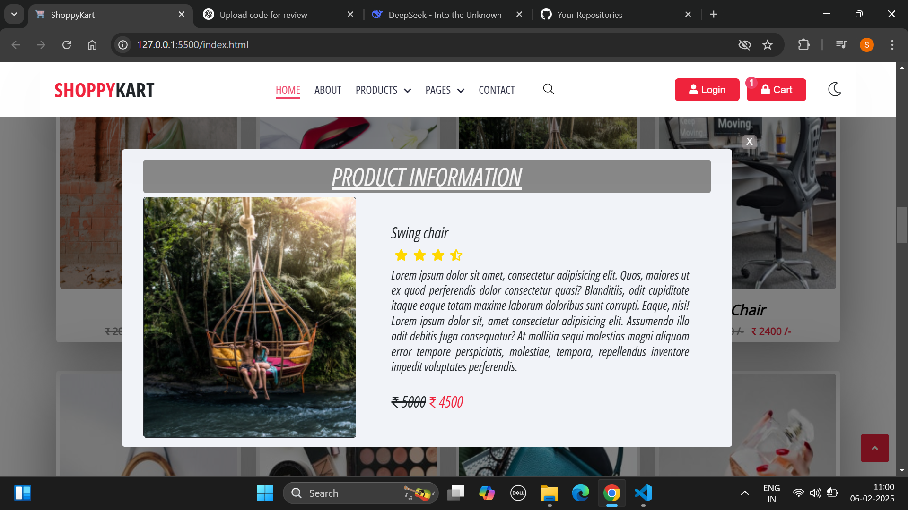
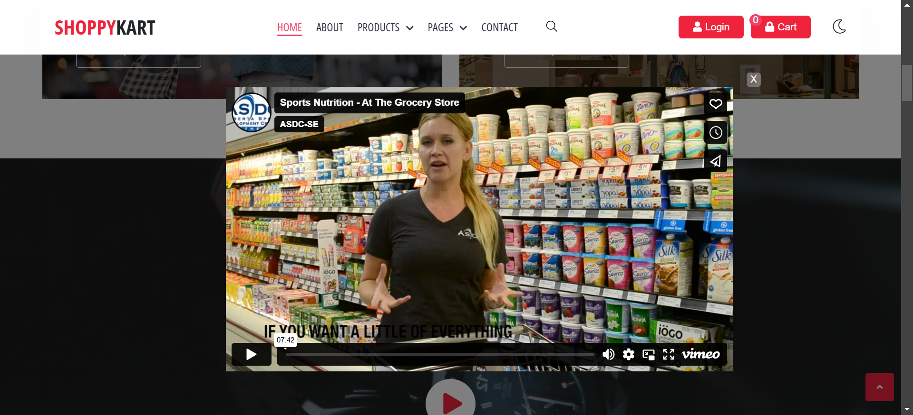
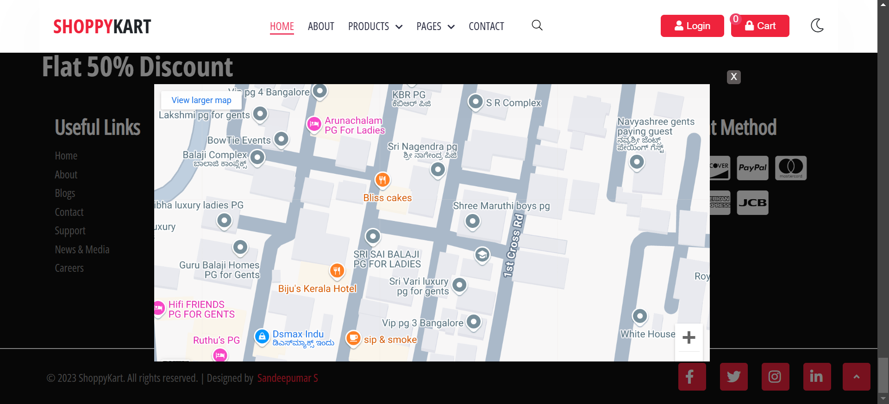
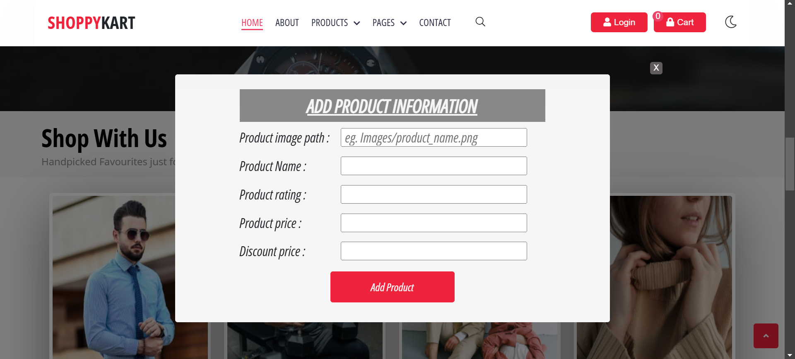

# E-Commerce Web Application

Welcome to the **E-Commerce Web Application** – a seamless and dynamic platform where users can browse through products, add them to their cart, and enjoy a fully functional shopping experience, all built using modern web technologies: **HTML**, **CSS**, and **JavaScript**.

---

## 📸 Preview

.png)







---

## 🛠 **Features**

- **Product Catalog**: Users can view and explore a variety of products with detailed images, ratings, and descriptions.
- **Interactive Cart**: Add products to your cart and view the total price dynamically.
- **Dark/Light Theme Toggle**: Enhance the browsing experience by switching between light and dark themes.
- **Zoom-in Product Images**: Hover over product images to zoom in for more details.

---

## 💻 **Tech Stack**

- **HTML**: Semantic structure for the web pages.
- **CSS**: Styling and layout using custom fonts, grids, and flexbox.
- **JavaScript**: Core interactivity, including product management, cart operations, and UI functionality.
- **LocalStorage**: Data persistence for cart items and product listings, ensuring data is not lost across sessions.
- **External Libraries**:
  - [Font Awesome](https://fontawesome.com/): For the history button icon.
  - [SweetAlert](https://sweetalert.js.org/): For error alerts (e.g., division by zero).

---

## 👨‍💻 Installation

1. Clone this repository:
   ```bash
   git clone https://github.com/sandeepku-s/ShoppyKart-template
   ```
2. Navigate to the project directory:
   ```bash
   cd ShoppyKart-template
   ```
3. Open `Index.html` in your web browser to use the ShoppyKart-template.

---

## 🛍️ Usage

### 🖥️ **User Interface**

1. **Product Display**:
   - Products are displayed on the main page in a grid layout.
   - Each product shows the image, name, rating, original price, and discounted price.
   
2. **Product Details**:
   - Clicking on a product name or image opens a detailed view of the product with additional information like rating, price, and description.
   
3. **Add to Cart**:
   - Users can add products to the cart directly from the main product display.
   - The cart icon in the header shows the current count of products in the cart.

4. **Cart Management**:
   - View cart by clicking the cart icon in the header.
   - The cart dynamically updates with the total price.

### 💳 **Checkout Process**

- Once the user is ready to purchase, they can view the total cart amount and proceed with checkout.
- The project uses a simple SweetAlert confirmation upon successful checkout.
  
---

## 📂 Project Structure

Here is an overview of the project structure:

```bash
ShoppyKart-template/
├── index.html               # The main HTML file with the product listing and cart structure
├── CSS/
│   ├── Style.css            # The main stylesheet for page layouts and UI
│   └── Font.css             # Additional styles related to custom fonts
├── Fonts/
│   └── font_templates       # Custom fonts and templates used in the app
├── Images/
│   ├── product_1.jpg        # Example product image
│   ├── product_2.jpg        # Another example image
│   └── .............	     # All Images
└── Script.js                # JavaScript logic for managing products, cart, and UI behavior
```

---

## 🚀 Deployment

This project can be deployed easily using platforms like [GitHub Pages](https://pages.github.com/). To preview the live version, visit:

---

### 🚀 **Live Demo** 
You can preview the live demo of the application by following this link:
[Demo Link](https://sandeepku-s.github.io/ShoppyKart-template/)

---
